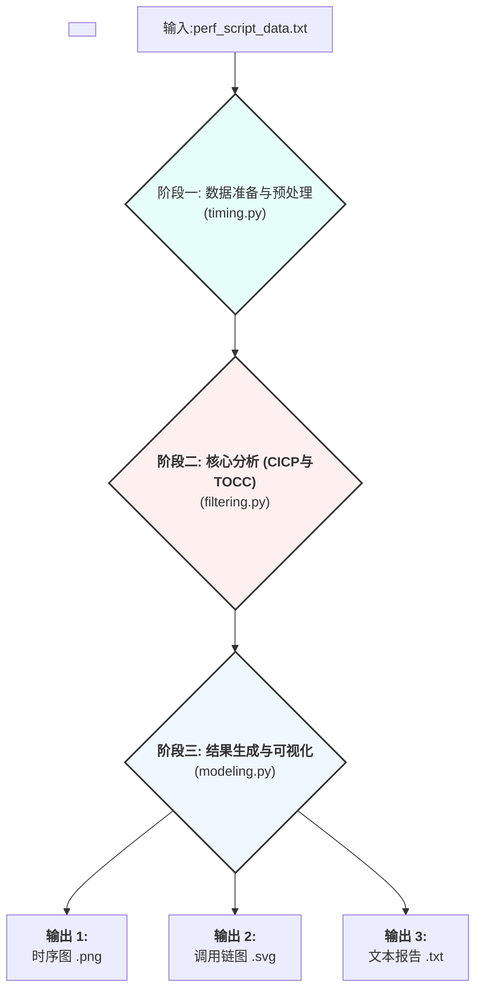

# 上游仓库信息

[TCSA](https://github.com/solecnugit/TCSA)

# 新增的内容

## 测试程序

1. 新增了一个C的测试程序在[contender.c](./mock/contender.c)
这个程序会：

- 创建一个全局的、非原子性的锁（用一个 `volatile int` 变量模拟）。
- 创建大量（例如 10 个）“等待者”线程。
- 每个“等待者”线程都会进入一个函数调用链，最终在一个无限循环里不断检查锁是否被释放（这就是“忙等待”）。
- 一旦某个线程获得锁，它会模拟一小段“工作”（通过 sleep），然后释放锁，让其他线程继续争抢。

复现了 TCSA 想要解决的问题：

- 资源争用: 所有线程争抢同一个 g_lock。
- 忙等待: 等待的线程在消耗 CPU，而不是被内核调度出去。
- 连续相同调用路径 (CICP) : 所有等待线程的函数调用栈都将卡在同一个循环检查函数上，形成完全相同的调用栈，这是 TCSA 检测的关键特征。

可以这样使用这个测试程序:

```bash
gcc -o contender contender.c -pthread
while true; do ./contender; done
```

新开一个终端

```bash
sudo perf record -F 999 -a -g sleep 5
# 5秒之后
sudo perf script > perf_contention_data.txt
```

之后使用代码分析

```bash
python main.py perf_quick_test.txt ./quick_results
```

## 必要的依赖

```bash
sudo apt update
sudo apt install git
sudo apt install python3 python3-pip
sudo apt install graphviz
sudo apt install linux-tools-$(uname -r) linux-tools-generic
```

## 测试的一些结果

可以在[results_example](./results_example/)下看到我的一些测试结果

## 代码逻辑



---

# 以下是上游仓库的readme

# TCSA: Efficient Localization of Busy-Wait Synchronization Bugs for Latency-Critical Applications

This repository is the implementation of TCSA.

# Usage

## Performance Data Collection

We have implemented a performance data collection script in the `collector` folder to automate the collection of performance data by setting parameters for sampling.
The sampling parameters include: start time, end time, sampling frequency, and sampling period of performance data sampling.

There are two ways to realize automated sampling:

(1) Set the above parameters in recorder.bash to execute automated sampling and immediately execute recorder.bash.

(2) Setting a timer (e.g., `cron`) to execute the `recorder.bash` script file at regular intervals.

Let's take `cron` as an example to illustrate (2).

- First edit the cron task list with `crontab -e`.
- Then add the timed tasks you want to execute. Example: `0 3 * * * * /path/recorder.bash` means "Execute the recorder.bash script under the `/path` path at 3:00 a.m. every day".

After `recorder.bash` is executed, the performance data is stored in the current directory.

The `converter.bash` script converts all `perfX.data` into `perfX.txt` files.

Of course, it is also possible to perform the performance data collection and conversion process manually.

## Localization with TCSA

We automate the location of busy-wait synchronization performance bugs by executing TCSA as shown below. We need to specify the path to the performance data to be analyzed and specify the path to where the result files of the automated location are stored.

Use the command as follows:

**`python main.py <file_path> <output_path> [direction] [degrees_of_freedom] [threshold]`**

`file_path` : The path of the collected function call stack data, include the file name.

`output_path` : The path to store the output results.

` direction ` : The direction of identification of consecutive identical call stacks. 1 means top-down, 0 means bottom-up.

`degrees_of_freedom` : The depth when judging consecutive identical events for threads.

` threshold ` : Set the threshold value for the number of durations. The default -1 means use the average value.

# Requirements

The specific environment requirements for python are in the requirements.txt file.

- python3

- Linux perf

# Example

# People

- System Optimization Lab, East China Normal University (SOLE)

# Contact Information

If you have any questions or suggestions, please contact Ning Li via ningli@stu#DOTecnu#DOTedu.cn.

# Repository Special Description

origin: <https://jihulab.com/solecnu/tcsa>

mirror: <https://github.com/MercuryLc/TCSA>
