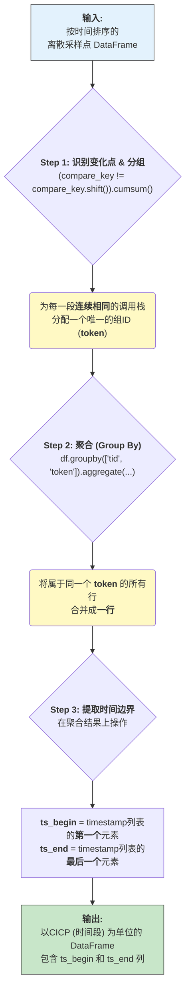
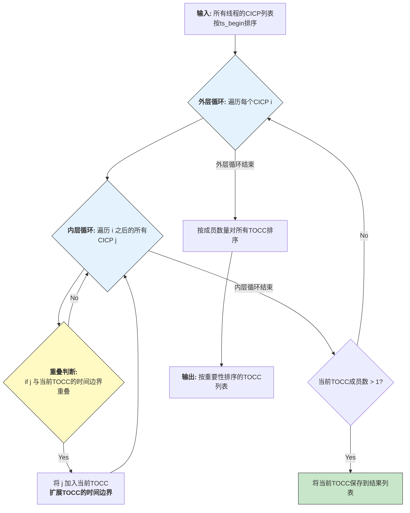
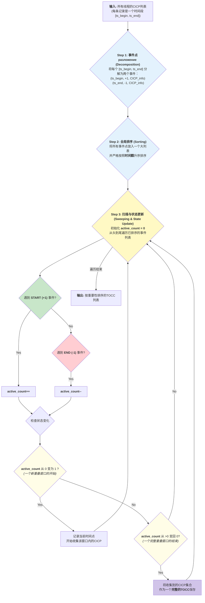
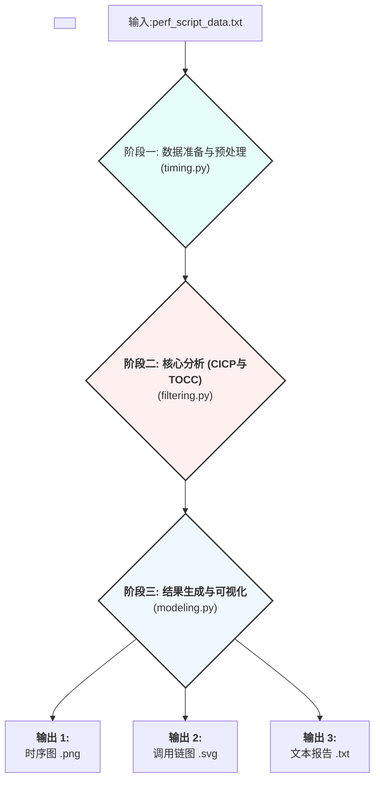

# 上游仓库信息

[TCSA](https://github.com/solecnugit/TCSA)

# 新增的内容

## 优化了一些内容

### 原始的操作流程(判断竞程组的方法)

#### 先从原始数据分离出t_begin 和 t_end

 [timing.py](./timing.py) 的 `data_processing` 函数。它处理完 `perf script` 的输出后，生成的 DataFrame (`perf_records_df`) 的每一行都代表**一个离散的采样点**。

这个 DataFrame 中有一列至关重要：

* **`timestamp`**: 这一列存放的是每个采样**事件发生的确切时间点**（一个浮点数）。

**此时，我们只有“点”，还没有“线”。**

**示例 DataFrame (`perf_records_df`) 的样子：**

| ... | timestamp | tid | function\_call\_stack (字符串) |
| :-- | :--- | :-: | :--- |
| **0** | 1000.001 | 123 | "funcC;funcB;funcA" |
| **1** | 1000.002 | 123 | "funcC;funcB;funcA" |
| **2** | 1000.003 | 123 | "funcC;funcB;funcA" |
| **3** | 1000.004 | 123 | "funcZ;funcY;funcX" |
| **4** | 1000.005 | 123 | "funcZ;funcY;funcX" |
| ... | ... | ... | ... |

---

### **核心：`identify_consecutive_identical_call_stacks`



#### **具体代码解析**

我们来看原版 `identify_consecutive_identical_call_stacks` 函数中的关键几步：

1. **分组和打标签 (`token`)**:

```python
    # 对每个线程独立操作
    for thread in threads_list:
        thread_df = perf_records_df[perf_records_df.tid == thread]
        compare_key = thread_df['user_defined_indentical_call_stacks']
        
        # 这一行是魔法的核心
        thread_df.loc[:, ('token')] = (compare_key != compare_key.shift()).cumsum()
```

执行完这步后，我们的示例 DataFrame 会多一列 `token`：

| ... | timestamp | tid | function\_call\_stack | **token** |
| :-- | :--- | :-: | :--- | :--- |
| **0** | 1000.001 | 123 | "funcC;funcB;funcA" | **1** |
| **1** | 1000.002 | 123 | "funcC;funcB;funcA" | **1** |
| **2** | 1000.003 | 123 | "funcC;funcB;funcA" | **1** |
| **3** | 1000.004 | 123 | "funcZ;funcY;funcX" | **2** |
| **4** | 1000.005 | 123 | "funcZ;funcY;funcX" | **2** |

可以看到，所有连续相同的调用栈都有了同一个 `token` ID。

2. **按 `token` 聚合**:

```python
    thread_df = thread_df.groupby(['token'], as_index=False).aggregate(lambda x: list(x))
```

`groupby('token')` 会把 `token` 相同的行分为一组。`aggregate(lambda x: list(x))` 会把每一列的值都聚合成一个列表。

执行后，DataFrame 变成了这样（只展示 `timestamp` 和 `token` 列）：

| token | **timestamp (现在是列表了)** | ... |
| :--- | :--- | :--- |
| **1** | `[1000.001, 1000.002, 1000.003]` | ... |
| **2** | `[1000.004, 1000.005]` | ... |

现在每一行代表一个 CICP 事件，但时间信息被藏在了列表里。

3. **提取 `ts_begin` 和 `ts_end`**:

```python
    thread_df['ts_begin'] = thread_df['timestamp'].apply(lambda x: x[0])
    thread_df['ts_end'] = thread_df['timestamp'].apply(lambda x: x[-1])
```

这两行代码从 `timestamp` 列表里提取信息：
    *`ts_begin` 被赋值为列表的**第一个元素**（`x[0]`）。
    *   `ts_end` 被赋值为列表的**最后一个元素**（`x[-1]`）。

经过这一步，我们的 DataFrame 终于变成了我们期望的、以“段”为单位的格式：

| token | ... | **ts_begin** | **ts_end** |
| :--- | :--- | :--- | :--- |
| **1** | ... | **1000.001** | **1000.003** |
| **2** | ... | **1000.004** | **1000.005** |

### 划分出竞程组

`divide_TOCC` (Divide Tightly Overlapped Call-chain-sets) ：**从所有线程的 CICP（连续相同调用栈周期）事件中，识别出那些在时间上“紧密重叠”的事件集合，也就是“竞争组”（Contention Groups）。**
> 一个“竞争组”或 TOCC，代表了一组线程活动，这些活动在时间上高度纠缠，因此有很大概率是在争抢同一个底层资源。\
**输入**: 一个 DataFrame `df`，其中的每一行都是一个CICP事件，包含了 `ts_begin`, `ts_end`, `tid` 等信息。\
**输出**: 一个 Python 列表 `tocc_df_list`。这个列表的**每一项**都是一个独立的 Pandas DataFrame，而每个 DataFrame 就代表一个被识别出的 TOCC (竞争组)。

#### **`divide_TOCC` 的算法逻辑**

原版的 `divide_TOCC` 使用了一种直观但效率较低的“**贪心扩展**”算法来寻找重叠集合。



**我们用一个具体的例子来走一遍这个流程：**

假设我们有以下4个CICP事件（已按`ts_begin`排序）：

* CICP A: `[1, 5]`
* CICP B: `[2, 6]`
* CICP C: `[4, 8]`
* CICP D: `[10, 12]`

**执行流程：**

1. **外层循环启动，`i` 指向 CICP A:**
    * 创建一个新的 TOCC，成员只有 {A}。当前时间边界是 `[1, 5]`。
    * **内层循环启动，`j` 指向 CICP B:**
        * B 的 `[2, 6]` 与当前边界 `[1, 5]` 重叠。
        * 将 B 加入 TOCC，成员变为 {A, B}。
        * 更新时间边界为 `[min(1,2), max(5,6)]` -> `[1, 6]`。
    * **内层循环继续，`j` 指向 CICP C:**
        * C 的 `[4, 8]` 与当前边界 `[1, 6]` 重叠。
        * 将 C 加入 TOCC，成员变为 {A, B, C}。
        * 更新时间边界为 `[min(1,4), max(6,8)]` -> `[1, 8]`。
    * **内层循环继续，`j` 指向 CICP D:**
        * D 的 `[10, 12]` 与当前边界 `[1, 8]` **不重叠**。跳过。
    * 内层循环结束。当前 TOCC {A, B, C} 成员数大于1，将其保存到结果列表。

2. **外层循环继续，`i` 指向 CICP B:**
    * （为了避免重复计算，代码中使用 `ts_begin_dic` 来标记已经处理过的CICP，所以B, C会被跳过）。

3. **外层循环继续，`i` 指向 CICP D:**
    * 创建一个新的 TOCC {D}，边界 `[10, 12]`。
    * 内层循环找不到能与它重叠的CICP。
    * 内层循环结束。当前 TOCC {D} 成员数不大于1，被丢弃。

4. **最终结果**:
    * 识别出一个 TOCC，包含了 {A, B, C}。
    * `divide_TOCC` 会返回一个列表，其中只有一个元素，这个元素是包含了 A, B, C 这三行CICP记录的 DataFrame。

#### **性能问题**

这个函数的原版实现，因为嵌套循环，时间复杂度是 $O(N^2)$。当CICP数量 N 达到几万甚至几十万时，平方级的计算量是灾难性的，会导致程序执行非常缓慢。这也是为什么我们之前要用 **扫描线算法 (`divide_TOCC_optimized`)** 将其优化到 $O(N \log N)$ 的原因。优化后的算法逻辑上实现了同样的目标，但效率天差地别。

#### **优化后算法的流程详解 (`divide_TOCC_optimized`)**



**我们用之前那个具体的例子来走一遍优化后的流程：**

**输入CICP事件：**

* CICP A (tid=1): `[1, 5]`
* CICP B (tid=2): `[2, 6]`
* CICP C (tid=3): `[4, 8]`
* CICP D (tid=4): `[10, 12]`

**Step 1 & 2: 分解并排序事件点**

分解成 (时间, 类型, 线程ID) 元组，并排序：

1. `(1, +1, tid=1)`  (A 开始)
2. `(2, +1, tid=2)`  (B 开始)
3. `(4, +1, tid=3)`  (C 开始)
4. `(5, -1, tid=1)`  (A 结束)
5. `(6, -1, tid=2)`  (B 结束)
6. `(8, -1, tid=3)`  (C 结束)
7. `(10, +1, tid=4)` (D 开始)
8. `(12, -1, tid=4)` (D 结束)

**Step 3: 扫描时间线**

初始化 `active_count = 0`, `current_tocc_group = []`。

* **扫描到 `t=1`**:
  * 事件: `(1, +1, tid=1)`
  * `active_count` 从 0 变为 1。这是一个**新窗口的开始**。
  * `active_count` 增加到 1。
  * 将 CICP A 加入 `current_tocc_group`。

* **扫描到 `t=2`**:
  * 事件: `(2, +1, tid=2)`
  * `active_count` 增加到 2。
  * 将 CICP B 加入 `current_tocc_group`。

* **扫描到 `t=4`**:
  * 事件: `(4, +1, tid=3)`
  * `active_count` 增加到 3。
  * 将 CICP C 加入 `current_tocc_group`。

* **扫描到 `t=5`**:
  * 事件: `(5, -1, tid=1)`
  * `active_count` 减少到 2。

* **扫描到 `t=6`**:
  * 事件: `(6, -1, tid=2)`
  * `active_count` 减少到 1。

* **扫描到 `t=8`**:
  * 事件: `(8, -1, tid=3)`
  * `active_count` 减少到 0。这是一个**窗口的结束**。
  * 此时，`current_tocc_group` 包含 {A, B, C}，成员数大于1。
  * **将 {A, B, C} 作为一个完整的 TOCC 保存下来**。
  * 清空 `current_tocc_group`。

* **扫描到 `t=10`**:
  * 事件: `(10, +1, tid=4)`
  * `active_count` 从 0 变为 1。新窗口开始。
  * `active_count` 增加到 1。
  * 将 CICP D 加入 `current_tocc_group`。

* **扫描到 `t=12`**:
  * 事件: `(12, -1, tid=4)`
  * `active_count` 减少到 0。窗口结束。
  * 此时，`current_tocc_group` 只包含 {D}，成员数不大于1，**被丢弃**。

**最终结果**: 与原版算法一样，识别出包含 {A, B, C} 的唯一 TOCC。

---

#### **为什么优化后的算法更快？**

1. **根本区别**: 它将一个需要两两比较所有区间的 $O(N^2)$ 问题，转化成了一个只需对所有端点进行一次排序 ($O(N \log N)$) 和一次线性扫描 ($O(N)$) 的问题。总的时间复杂度由排序决定，即 $O(N \log N)$。
2. **避免冗余计算**: 原版算法中，CICP C 不仅会和 {A, B} 组成的集合比较，之前 B 也会和 A 比较。存在大量重复的重叠判断。而扫描线算法的每一步都只处理一个事件点，状态更新简单清晰，没有任何冗余计算。

## 其他优化

其余的均是利用多线程优化了数据的处理过程,并没有太大的提升

## 理解perf 的输出

### example

```txt
perf 9345 [002] 5736.328087: 1 cycles:P:
ffffffffabfc3836 native_write_msr+0x6 ([kernel.kallsyms])
ffffffffabf0fd08 amd_pmu_enable_all+0x68 ([kernel.kallsyms])
ffffffffabf0b3c0 x86_pmu_enable+0x150 ([kernel.kallsyms])
ffffffffac2d2143 ctx_resched+0x1c3 ([kernel.kallsyms])
ffffffffac2d24a9 __perf_event_enable+0x289 ([kernel.kallsyms])
ffffffffac2c9159 event_function+0x99 ([kernel.kallsyms])
ffffffffac2c49ff remote_function+0x4f ([kernel.kallsyms])
ffffffffac13eaaf generic_exec_single+0x7f ([kernel.kallsyms])
ffffffffac13ec27 smp_call_function_single+0xa7 ([kernel.kallsyms])
ffffffffac2c8be1 event_function_call+0x1c1 ([kernel.kallsyms])
ffffffffac2c8ce6 _perf_event_enable+0x66 ([kernel.kallsyms])
ffffffffac2c3960 perf_event_for_each_child+0x40 ([kernel.kallsyms])
ffffffffac2da302 _perf_ioctl+0x202 ([kernel.kallsyms])
ffffffffac2da8b5 perf_ioctl+0x45 ([kernel.kallsyms])
ffffffffac44b517 __x64_sys_ioctl+0xa7 ([kernel.kallsyms])
ffffffffabf04343 x64_sys_call+0x1053 ([kernel.kallsyms])
ffffffffad1293fe do_syscall_64+0x7e ([kernel.kallsyms])
ffffffffabc0012b entry_SYSCALL_64_after_hwframe+0x76 ([kernel.kallsyms])
7b124bd2f21d __GI___ioctl+0x3d (/usr/lib/x86_64-linux-gnu/libc.so.6)
63c67eebe1de perf_evsel__ioctl+0x7b (/usr/bin/perf)
63c67eebe21f perf_evsel__run_ioctl+0x3f (/usr/bin/perf)
63c67eebe27e perf_evsel__enable_cpu+0x2e (/usr/bin/perf)
63c67efa49c2 __evlist__enable.constprop.0+0xe2 (/usr/bin/perf)
63c67ee4dac4 __cmd_record.constprop.0+0x1fd4 (/usr/bin/perf)
63c67ee4fc46 cmd_record+0xe36 (/usr/bin/perf)
63c67eeb8160 run_builtin+0x70 (/usr/bin/perf)
63c67eeb847b handle_internal_command+0xab (/usr/bin/perf)
63c67ee3682b main+0x2fb (/usr/bin/perf)
7b124bc2a578 __libc_start_call_main+0x78 (/usr/lib/x86_64-linux-gnu/libc.so.6)
7b124bc2a63b __libc_start_main@@GLIBC_2.34+0x8b (/usr/lib/x86_64-linux-gnu/libc.so.6)
63c67ee36e75 _start+0x25 (/usr/bin/perf)
```

### **第一层：事件头（The Header Line）**

> `perf 9345 [002] 5736.328087: 1 cycles:P:`

这一行是这个采样事件的“元数据”，我们把它拆解开来看：

* **`perf`**: 这是产生这个事件的**进程名 (command name)**。这说明 `perf` 工具本身在运行时也被自己采样到了。
* **`9345`**: 这是进程的**线程ID (Thread ID, tid)**。在本例中，就是 `perf` 进程的一个线程。
* **`[002]`**: 这个事件发生在**第 2 号 CPU 核心**上。
* **`5736.328087`**: 这是事件发生的**时间戳 (timestamp)**，单位是秒，从系统启动开始计算。这是 TCSA 进行时间序列分析的依据。
* **`1 cycles:P:`**:
  * `1 cycles`: 这是**事件计数值**。对于`cycles`事件，它表示从上一次采样到这一次采样之间，大约经过了多少个CPU周期。这个值 `1` 通常不是精确的，只是表示一个采样点。
  * `:P`: 这是**事件属性**的标记。`P` 代表这是一个精确的事件（Precise Event），但对于我们的分析，这个细节通常不重要。

### **第二层：函数调用栈（The Call Stack）**

事件头下面的所有带缩进的行，共同构成了该时刻、该线程的**完整函数调用栈**。这个栈是**自顶向下**排列的，也就是说：

* **栈顶 (Top of the Stack)**: 最上面的一行是 CPU **当前正在执行**的函数。
* **栈底 (Bottom of the Stack)**: 最下面的一行是这个线程的入口函数。

调用关系是：**下一行调用了上一行**。

让我们从下往上，追溯这个线程的“生命历程”：

1. **`_start` -> `__libc_start_main...` -> `main`**:
    > `_start` (/usr/bin/perf) -> `__libc_start_main...` (/usr/lib/...) -> `main` (/usr/bin/perf)
    * **解读**: 这是任何一个标准 C 程序启动的经典流程。`_start` 是程序的入口点，它调用 C 库的 `__libc_start_main` 来进行初始化，然后 `__libc_start_main` 再调用我们自己编写的 `main` 函数。

2. **`main` -> `handle_internal_command` -> `run_builtin` -> `cmd_record`**:
    > `main` -> ... -> `cmd_record` (/usr/bin/perf)
    * **解读**: `perf` 程序的 `main` 函数解析了我们的命令（`record`），然后进入了 `cmd_record` 这个核心函数，专门负责执行“记录”这个子命令。

3. **用户空间调用链 (User Space)**:
    > `__GI___ioctl` (/usr/lib/...) -> `perf_evsel__ioctl` (/usr/bin/perf) -> ...
    * **解读**: 从 `_start` 一直到 `__GI___ioctl`，这些函数运行在**用户空间 (User Space)**。它们的地址（十六进制数）通常较小。最后的 `ioctl` 是一个**系统调用 (System Call)**，它是用户态程序请求内核服务的“大门”。通过它，`perf` 程序请求内核“请帮我启用/配置性能监控事件”。

4. **进入内核 (Entering Kernel)**:
    > `entry_SYSCALL_64_after_hwframe` ([kernel.kallsyms]) -> ...
    * **解读**: 从这一行开始，`([kernel.kallsyms])` 这个标记告诉我们，程序的执行已经从用户态切换到了**内核态 (Kernel Mode)**。`entry_SYSCALL_64...` 是 64 位系统处理系统调用的标准入口点。

5. **内核空间调用链 (Kernel Space)**:
    > `do_syscall_64` -> `__x64_sys_ioctl` -> `perf_ioctl` -> ... -> `native_write_msr`
    * **解读**: 内核接收到 `ioctl` 请求后，经过一系列内部函数的调用，最终目的是去操作处理器的特定寄存器（MSR - Model-Specific Register）来开启性能计数器。最顶部的 `native_write_msr` 就是正在执行的、最具体的操作——“写入一个MSR寄存器”。

## 测试程序

1. 新增了一个C的测试程序在[contender.c](./mock/contender.c)
这个程序会：

* 创建一个全局的、非原子性的锁（用一个 `volatile int` 变量模拟）。
* 创建大量（例如 10 个）“等待者”线程。
* 每个“等待者”线程都会进入一个函数调用链，最终在一个无限循环里不断检查锁是否被释放（这就是“忙等待”）。
* 一旦某个线程获得锁，它会模拟一小段“工作”（通过 sleep），然后释放锁，让其他线程继续争抢。

复现了 TCSA 想要解决的问题：

* 资源争用: 所有线程争抢同一个 g_lock。
* 忙等待: 等待的线程在消耗 CPU，而不是被内核调度出去。
* 连续相同调用路径 (CICP) : 所有等待线程的函数调用栈都将卡在同一个循环检查函数上，形成完全相同的调用栈，这是 TCSA 检测的关键特征。

可以这样使用这个测试程序:

```bash
gcc -o contender contender.c -pthread
while true; do ./contender; done
```

新开一个终端

```bash
sudo perf record -F 999 -a -g sleep 5
# 5秒之后
sudo perf script > perf_contention_data.txt
```

之后使用代码分析

```bash
python main.py perf_quick_test.txt ./quick_results
```

## 必要的依赖

```bash
sudo apt update
sudo apt install git
sudo apt install python3 python3-pip
sudo apt install graphviz
sudo apt install linux-tools-$(uname -r) linux-tools-generic
```

## 测试的一些结果

可以在[results_example](./results_example/)下看到我的一些测试结果

## 代码逻辑



---

# 以下是上游仓库的readme

# TCSA: Efficient Localization of Busy-Wait Synchronization Bugs for Latency-Critical Applications

This repository is the implementation of TCSA.

# Usage

## Performance Data Collection

We have implemented a performance data collection script in the `collector` folder to automate the collection of performance data by setting parameters for sampling.
The sampling parameters include: start time, end time, sampling frequency, and sampling period of performance data sampling.

There are two ways to realize automated sampling:

(1) Set the above parameters in recorder.bash to execute automated sampling and immediately execute recorder.bash.

(2) Setting a timer (e.g., `cron`) to execute the `recorder.bash` script file at regular intervals.

Let's take `cron` as an example to illustrate (2).

* First edit the cron task list with `crontab -e`.
* Then add the timed tasks you want to execute. Example: `0 3 * * * * /path/recorder.bash` means "Execute the recorder.bash script under the `/path` path at 3:00 a.m. every day".

After `recorder.bash` is executed, the performance data is stored in the current directory.

The `converter.bash` script converts all `perfX.data` into `perfX.txt` files.

Of course, it is also possible to perform the performance data collection and conversion process manually.

## Localization with TCSA

We automate the location of busy-wait synchronization performance bugs by executing TCSA as shown below. We need to specify the path to the performance data to be analyzed and specify the path to where the result files of the automated location are stored.

Use the command as follows:

**`python main.py <file_path> <output_path> [direction] [degrees_of_freedom] [threshold]`**

`file_path` : The path of the collected function call stack data, include the file name.

`output_path` : The path to store the output results.

` direction ` : The direction of identification of consecutive identical call stacks. 1 means top-down, 0 means bottom-up.

`degrees_of_freedom` : The depth when judging consecutive identical events for threads.

` threshold ` : Set the threshold value for the number of durations. The default -1 means use the average value.

# Requirements

The specific environment requirements for python are in the requirements.txt file.

* python3

* Linux perf

# Example

# People

* System Optimization Lab, East China Normal University (SOLE)

# Contact Information

If you have any questions or suggestions, please contact Ning Li via ningli@stu#DOTecnu#DOTedu.cn.

# Repository Special Description

origin: <https://jihulab.com/solecnu/tcsa>

mirror: <https://github.com/MercuryLc/TCSA>
